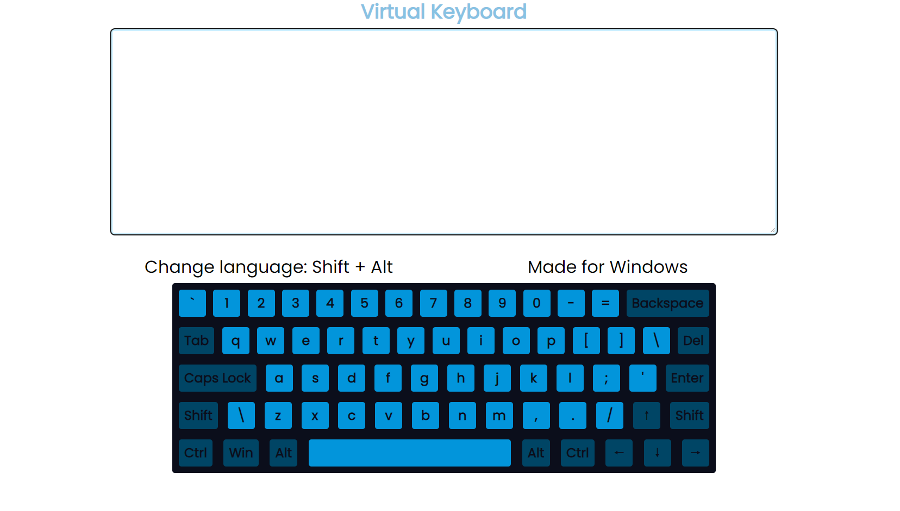
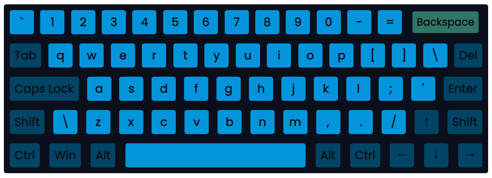
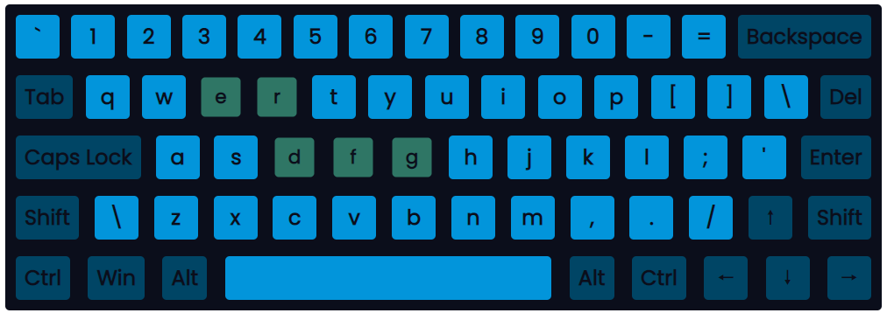
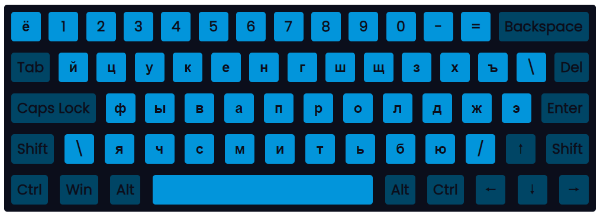

# virtual-keyboard

## Описание проекта
Virtual Keyboard - это виртуальная клавиатура.

<kbd></kbd>

## Функциональность:
- изначально файл index.html пустой (все необходимые элементы генерируются с использованием JS)
- нажатие на кнопкy физической клавиатуры подсвечивает нажатую кнопку на виртуальной:
    
- Если нажатие происходит на несколько кнопок, то подсвечиваются все нажатые кнопки (исключений нет и для ctrl-alt-shift):
  
- виртуальная клавиатура умеет переключаться между русской и английской раскладками (сочетание клавиш — Shift + Alt), при этом на кнопках отображаться символы выбранного языка:
  
- выбранный язык сохраняться после перезагрузки страницы. Кнопки для смены языка указаны на странице c клавиатурой, что бы было понятно, как пользователю поменять язык на клавиатуре
- анимация нажатия на кнопку
- клики по кнопкам мышкой на виртуальной клавиатуре и нажатие на кнопки физической клавиатуры выводят символы в инпут (textarea), расположенный на странице над клавиатурой. Нажатие стрелок вниз-вверх-влево-вправо, на `enter`, `tab`, `backspace`, `del` не реализовано. Оставшиеся `shift`, `alt`, `ctrl`, `caps lock`, `space` работают как в реальной клавиатуре.

- Вёрстка страницы состоит из одного контейнеров: `
`
  
[Деплой проекта](https://zixail28.github.io/virtual-keyboard/)  
